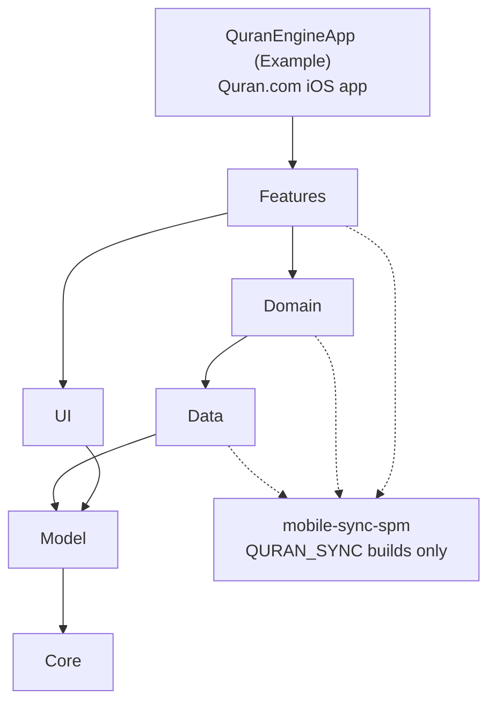

<p align="center">
    
</p>

# QuranEngine

[](https://github.com/quran/quran-ios/actions/workflows/ci.yml)
[](https://codecov.io/gh/quran/quran-ios)

QuranEngine is the open-source iOS library that powers the [Quran.com iOS App](https://apps.apple.com/app/id1118663303). This repository contains approximately 99% of the Quran.com iOS App code, providing you with a robust foundation to build Quran-related applications.

In this repository, we also provide an example application called QuranEngineApp that mimics the Quran.com iOS App, available under the [Example](Example) folder.

## Requirements

- Xcode 26 or later. CI builds with Xcode 26.2.
- iOS 15 or later.
- Swift Package Manager. We do not support CocoaPods or Carthage, and we do not plan to support them.

## Installation

Add the package with Swift Package Manager:

```swift
.package(url: "https://github.com/quran/quran-ios", branch: "main")
```

Then use one or more of its targets as dependencies. Every target is available as a product, for example:

```swift
.product(name: "AppStructureFeature", package: "quran-ios"),
```

To pin a release, use the commit of its tag with `.package(url: "https://github.com/quran/quran-ios", revision: "<commit>")`. Releases are tagged with the app's version. Version requirements such as `from:` do not work, because QuranEngine depends on a package that is pinned to a branch.

## Run the Example App

```sh
make run-example-no-sync
```

This builds QuranEngineApp, boots an iPhone simulator on the latest installed iOS, installs the app, and launches it. Use `make run-example-sync` for the sync-enabled build.

## Building and Testing

Every build and test command names its sync mode. `QURAN_SYNC` turns on Quran.com account sync, which adds the [mobile-sync-spm](https://github.com/quran/mobile-sync-spm) package. The `-no-sync` and `-sync` targets set it explicitly, so a value left in your shell never changes the build. Code behind `#if QURAN_SYNC` must compile in both modes.

```sh
# Build the package, or one scheme
make build-no-sync
make build-sync TARGET=NoorUI

# Run the complete package test plan
make test-no-sync
make test-sync

# Run one test target through the package test scheme
make test-no-sync TARGET=AyahMenuFeature
make test-sync TARGET=AyahMenuFeatureTests

# Check formatting
make format-lint
```

For test commands, `TARGET` accepts either the production target or its `Tests` target. Both focused examples above select `AyahMenuFeatureTests`. New test targets must also be added to `QuranEngine-Package.xctestplan`.

## Architecture

The library is split into 6 layers, each a top-level directory:

* **Core**: General purpose libraries that work with any app. The only exception is the Localization library, which we aim to make more universal.

* **Model**: Contains simple entities that facilitate building a Quran App. These entities mostly work together without including extensive logic.

* **Data**: Persistence and networking: SQLite (GRDB), Core Data, downloads, authentication, and the sync-backed stores. These libraries abstract away the underlying technologies.

* **Domain**: This is where the business logic of the app resides. It depends on Model and Data to serve such business logic.

* **UI**: Houses the design system used by the App, NoorUI. Components are built with SwiftUI; navigation stays in UIKit. UI does not depend on Domain or Data, but can depend on Core and Model.

* **Features**: Comprises the screens making up the app. They rely on all other components to create our Quran apps. Features can encompass other features to create higher-level features. For example, `AppStructureFeature` hosts all other features to create the app.



A layer may import any layer it can reach by following the arrows, plus other targets in its own layer. [Package.swift](Package.swift) enforces this: `TargetType.validDependencies` lists what each layer may import, and `validateDependenciesStructure` stops the manifest from loading when a target breaks the rule.

The other top-level directories are:

* **Example**: QuranEngineApp, the example app.
* **Tools**: Developer scripts, such as terminal SwiftUI previews and app icon export.
* **Documentation**: Guides for specific workflows.
* **AllTargetsTests**: Links targets without their own tests, so coverage reports include them.

## More Documentation

* [SwiftUI previews from the terminal](Documentation/Previews.md): run a file's `#Preview`s on a simulator with `make preview`.
* [Mobile sync local development](Documentation/MobileSyncLocalDevelopment.md): the `QURAN_SYNC` flag, OAuth settings, and building against local `mobile-sync` checkouts.

## Contributions

We warmly welcome contributions to the QuranEngine project. We encourage potential contributors to tackle any of the open issues. Please start a conversation with us in the Discussions section of the repo and we will do our best to assist you inshaa'Allah.

If your contribution is small enough, feel free to create a Pull Request directly. For larger contributions, we ask that you first create a post in the discussions section. This allows us to ensure that nobody else is working on the same feature, and also allows us to plan for upcoming features in case your contribution is dependent on another feature.

[AGENTS.md](AGENTS.md) describes the project's conventions for architecture, UI, concurrency, and tests. Run `make format-lint` before opening a pull request. UI and Features still have less test coverage than the foundational layers, so new behavior should include focused tests where practical.

## Intended Use

We are re-open sourcing the app because we see a lot of benefits in allowing developers to build on top of what we have already built. This way, developers don't have to re-implement the foundation and can innovate more on the idea itself. The malicious behavior we've seen previously, including but not limited to selling this free code to people who are not aware of this repo's existence, is negligible compared to the overall benefit of giving what we have implemented to others. We look forward to seeing great Islamic innovation that helps Muslims everywhere inshaa'Allah.

We welcome all types of use. However, we kindly ask that you don't use the QuranEngineApp example and republish it without making any modifications. You may also need to bring your own data.

## License and Credits

* QuranEngine is available under the Apache-2.0 license. See the [LICENSE](LICENSE) file for more info.
* The classic Madani (1405 AH) page images come from the [quran images project](https://github.com/quran/quran.com-images) on GitHub. The Medina 1421, 1439, 1440, and 1441 and the IndoPak page images are from the King Fahd Quran Printing Complex, and the Tajweed page images are from the Dar al-Marefa edition.
* Translation, tafsir, and Arabic data come from [QuranEnc](https://quranenc.com) and [King Saud University](https://quran.ksu.edu.sa). A small number of translations also come from [Tanzil](https://tanzil.net).
* Data is licensed under the licenses of its authors, typically [CC BY-NC-ND](https://creativecommons.org/licenses/by-nc-nd/2.0/), but this may differ depending on the source.
